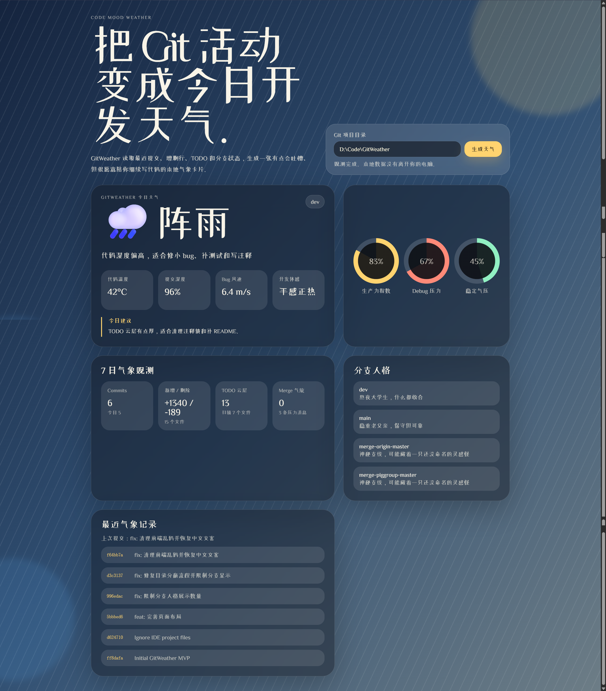
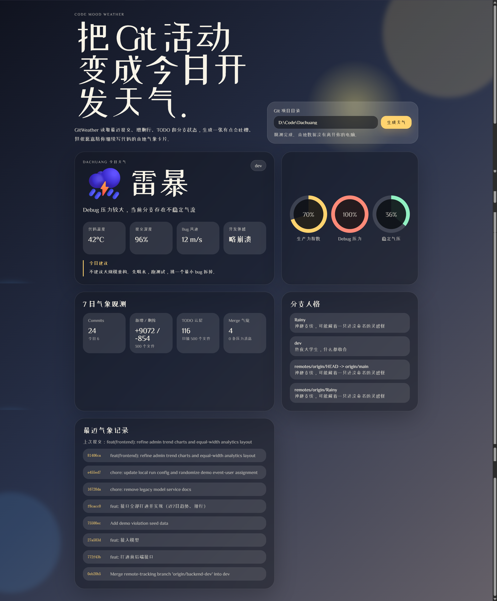

# GitWeather

GitWeather 把 Git 提交行为转成“开发天气”，让你在几秒内看到最近一周的节奏、压力和稳定性变化。

它不是另一个冷冰冰的统计面板，而是一个面向开发者日常决策的反馈工具：  
你可以快速判断这周是“稳定推进”，还是“风暴修复”。

## 为什么值得用

- 一眼看懂最近 7 天代码状态，不用翻 commit 才知道发生了什么。
- 把新增/删除、变更文件、TODO/FIXME、merge 活动等指标合成可读结论。
- 本地分析，不上传源码，适合个人项目和公司仓库。
- 轻量启动，开箱即用。

## 展示图

### 1) 总览仪表盘


### 2) 开发天气与状态面板



### 3) 分支人格与节奏洞察



## 核心能力

- `Code Weather`：晴 / 多云 / 雨 / 风暴 / 大雾等开发天气判断。
- 生产力、调试压力、稳定性等关键指标可视化。
- 代码温度、提交湿度、Bug 风速、开发舒适度等趣味指标。
- 分支人格标签与近期提交时间线。

## Quick Start

```bash
npm run dev
```

访问：

```text
http://127.0.0.1:4177
```

## 开发路线图（目标：IDE 插件化）

### Phase 1: 当前 Web 版增强

1. 支持多仓库快速切换与历史对比。
2. 增加每周/每月趋势报告导出。
3. 提升异常波动识别（如突发修复高峰）。

### Phase 2: IDE 插件 MVP（VS Code / JetBrains）

1. 在 IDE 侧边栏直接展示实时天气与关键指标。
2. 基于当前分支和近期提交给出上下文提示。
3. 提供“今天开发状态”摘要卡片（无侵入提醒）。

### Phase 3: 插件进阶能力

1. 团队维度趋势聚合（可选、可自建）。
2. AI 生成周报与风险提示（可配置开关）。
3. 与 CI 状态联动，形成“代码健康天气图”。

欢迎提 Issue / PR 一起把 GitWeather 做成真正好用的开发者插件体验。
